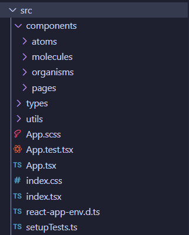
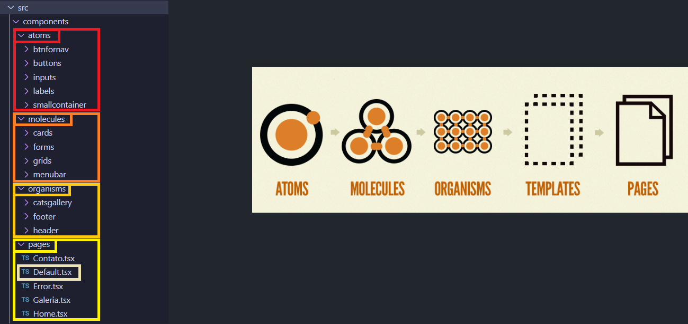

# Atomic Design & React

Atomic Design criado por:
- React 18
- Material UI
- Scss

## Metodologia & Estrutura

O design atômico é uma abordagem de design que organiza componentes em diferentes níveis de abstração, desde átomos (componentes simples) até organismos (componentes mais complexos).
  
O conceito principal do Atomic Design é dividir a interface em cinco níveis, chamados de "átomos", "moléculas", "organismos", "templates" e "páginas", representando componentes cada vez mais complexos e compostos. Esses elementos modulares podem ser organizados e combinados para criar interfaces consistentes e flexíveis. Embora o Atomic Design não seja uma "arquitetura" no sentido estrito, ele fornece uma estrutura conceitual para o desenvolvimento de componentes e sistemas de design, o que pode ser fundamental para a organização e manutenção de projetos de interface de usuário em larga escala. A aplicação prática do Atomic Design pode influenciar a arquitetura geral de um projeto, especialmente em termos de como os componentes são estruturados e organizados.

### Estrutura do projeto - Design Atomic:

A estrutura do projeto simples usando a seguinte hierarquia:

- Atoms: Componentes simples e reutilizáveis.
- Molecules: Componentes que combinam átomos para formar unidades mais complexas.
- Organisms: Componentes que combinam moléculas para formar partes maiores da interface.
- Pages: Páginas que combinam organismos para formar as visualizações completas.

### Estrutura 1 de diretórios:

### Estrutura 2 de diretórios:

### Bases de referência
- Atomic Design: (https://bradfrost.com/blog/post/atomic-web-design/);
- Referência: (https://atomicdesign.bradfrost.com/);

-- Comando para scss: `npm install sass --save-dev`