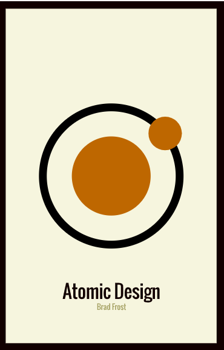

# Atomic Design & React

Atomic Design criado por:
- React 18
- Material UI
- Scss

## Arquitetura

O design atômico é uma abordagem de design que organiza componentes em diferentes níveis de abstração, desde átomos (componentes simples) até organismos (componentes mais complexos).

### Estrutura do projeto

A estrutura do projeto simples usando a seguinte hierarquia:

- Atoms: Componentes simples e reutilizáveis.
- Molecules: Componentes que combinam átomos para formar unidades mais complexas.
- Organisms: Componentes que combinam moléculas para formar partes maiores da interface.
- Pages: Páginas que combinam organismos para formar as visualizações completas.

### Bases de referência
- Atomic Design: (https://bradfrost.com/blog/post/atomic-web-design/);
- Referência: (https://atomicdesign.bradfrost.com/);

-- Comando para scss: `npm install sass --save-dev`