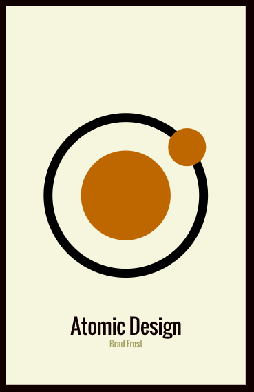

# Atomic Design & React

Atomic Design criado por:
- React 18
- Material UI
- Scss

## Metodologia & Estrutura

O design atômico é uma abordagem de design que organiza componentes em diferentes níveis de abstração, desde átomos (componentes simples) até organismos (componentes mais complexos).
  
O conceito principal do Atomic Design é dividir a interface em cinco níveis, chamados de "átomos", "moléculas", "organismos", "templates" e "páginas", representando componentes cada vez mais complexos e compostos. Esses elementos modulares podem ser organizados e combinados para criar interfaces consistentes e flexíveis. Embora o Atomic Design não seja uma "arquitetura" no sentido estrito, ele fornece uma estrutura conceitual para o desenvolvimento de componentes e sistemas de design, o que pode ser fundamental para a organização e manutenção de projetos de interface de usuário em larga escala. A aplicação prática do Atomic Design pode influenciar a arquitetura geral de um projeto, especialmente em termos de como os componentes são estruturados e organizados.

### Estrutura do projeto - Design Atomic:

A estrutura do projeto simples usando a seguinte hierarquia:

- Atoms: Componentes simples e reutilizáveis.
- Molecules: Componentes que combinam átomos para formar unidades mais complexas.
- Organisms: Componentes que combinam moléculas para formar partes maiores da interface.
- Pages: Páginas que combinam organismos para formar as visualizações completas.

### Estrutura 1 de diretórios:

### Estrutura 2 de diretórios:

### Estrutura 3 de diretórios (parte dela):

#### Observe a imagem:
- O **botão** que será usado na barra de menu é um `Átomo`: todas as funcionalidades dele são criadas ali e passadas para o MenuBar;
- O **MenuBar** é a junção dos átomos, portanto uma `Molécula`: aqui a configuração é um conjunto de átomos que forma uma molécula. O MenuBar precisa fazer parte do Header;
- O **Header**, por ser um componente maior e que pode conter várias funcionalidades, **como um MenuBar (uma molécula)**, **um Form para login (outra molécula)** ou mesmo alguma **informação relevante (mais uma molécula)**, fará parte dos `Organismos`;
- **Todos os organismos fazem parte de um `Template` que será apontado nas `Pages`**. Neste exemplo que estou mostrando, optei por manter o template, dentro de um componente chamado **Default**, por ser uma aplicação que exibe a metodologia de projeto **Atomic Design**, mas quando criamos um Design System (por ele ser muito mais escalável e possuir inúmeros componentes), é aconselhável criar a sessão de `Template` separada.

### Bases de referência
- Atomic Design: (https://bradfrost.com/blog/post/atomic-web-design/);
- Referência: (https://atomicdesign.bradfrost.com/);

-- Comando para scss: `npm install sass --save-dev`