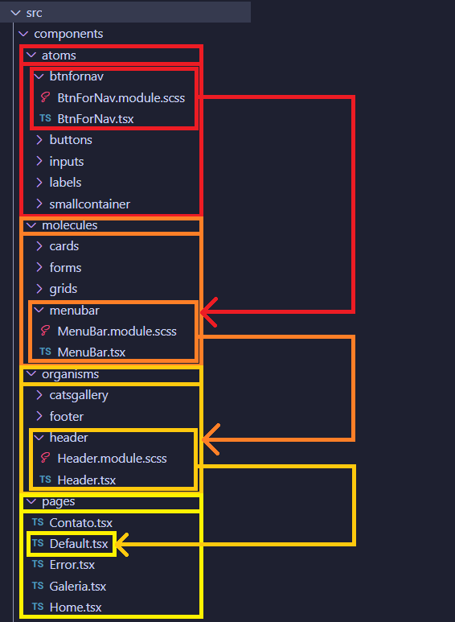

# Atomic Design & React

Atomic Design criado por:
- React 18
- Material UI
- Scss

## Metodologia & Estrutura

O design atômico é uma abordagem de design que organiza componentes em diferentes níveis de abstração, desde átomos (componentes simples) até organismos (componentes mais complexos).
  
O conceito principal do Atomic Design é dividir a interface em cinco níveis, chamados de "átomos", "moléculas", "organismos", "templates" e "páginas", representando componentes cada vez mais complexos e compostos. Esses elementos modulares podem ser organizados e combinados para criar interfaces consistentes e flexíveis. Embora o Atomic Design não seja uma "arquitetura" no sentido estrito, ele fornece uma estrutura conceitual para o desenvolvimento de componentes e sistemas de design, o que pode ser fundamental para a organização e manutenção de projetos de interface de usuário em larga escala. A aplicação prática do Atomic Design pode influenciar a arquitetura geral de um projeto, especialmente em termos de como os componentes são estruturados e organizados.

### Estrutura do projeto - Design Atomic:

A estrutura do projeto simples usando a seguinte hierarquia:

- Atoms: Componentes simples e reutilizáveis.
- Molecules: Componentes que combinam átomos para formar unidades mais complexas.
- Organisms: Componentes que combinam moléculas para formar partes maiores da interface.
- Pages: Páginas que combinam organismos para formar as visualizações completas.

### Estrutura 1 de diretórios:

### Estrutura 2 de diretórios:

### Estrutura 3 de diretórios (parte dela):

#### Observe a imagem:
- O **botão** que será usado na barra de menu é um `Átomo`: todas as funcionalidades dele são criadas ali e passadas para o MenuBar;
- O **MenuBar** é a junção dos átomos, portanto uma `Molécula`: aqui a configuração é um conjunto de átomos que forma uma molécula. O MenuBar precisa fazer parte do Header;
- O **Header**, por ser um componente maior e que pode conter várias funcionalidades, **como um MenuBar (uma molécula)**, **um Form para login (outra molécula)** ou mesmo alguma **informação relevante (mais uma molécula)**, fará parte dos `Organismos`;
- **Todos os organismos fazem parte de um `Template` que será apontado nas `Pages`**. Neste exemplo que estou mostrando, optei por manter o template, dentro de um componente chamado **Default**, por ser uma aplicação que exibe a metodologia de projeto **Atomic Design**, mas quando criamos um Design System (por ele ser muito mais escalável e possuir inúmeros componentes), é aconselhável criar a sessão de `Template` separada.

### Vantagens de trabalhar com Atomic Design & React:

- **Reutilização de Componentes:** O Atomic Design promove a criação de componentes modulares, permitindo a fácil reutilização em diferentes partes do aplicativo.
- **Consistência Visual:** A abordagem do Atomic Design facilita a criação de interfaces consistentes, pois os componentes são projetados e combinados de maneira padronizada.
- **Manutenibilidade:** A estrutura hierárquica do Atomic Design simplifica a manutenção do código, tornando mais fácil entender, atualizar e corrigir partes específicas do sistema.
- **Desenvolvimento Eficiente:** A construção de interfaces a partir de componentes predefinidos reduz o tempo de desenvolvimento, pois muitas partes do código podem ser reaproveitadas.
- **Testabilidade:** Componentes modulares são mais fáceis de testar, pois suas funcionalidades podem ser isoladas e testadas individualmente.
- **Escalabilidade:** À medida que o projeto cresce, a estrutura do Atomic Design facilita a escalabilidade, permitindo a adição de novos componentes sem comprometer a integridade do sistema.
- **Colaboração Efetiva:** A metodologia do Atomic Design facilita a colaboração entre designers e desenvolvedores, pois ambos seguem uma linguagem de design consistente.
- **Facilidade de Aprendizado:** Desenvolvedores novos podem compreender rapidamente a estrutura do projeto, uma vez que os componentes seguem um padrão organizacional.

### Trabalhar com módulos até na estilização:

Obviamente que a estilização aplicada em um projeto é definida pelo time inteiro. Neste projeto template, escolhi trabalhar com o Scss modular, pois na minha opinião, o encapsulamento das estilizações facilita o desenvolvedor.  
No projeto temos o `CSS Global`, onde estão definidos os **tokens de cores** (afinal não é um Design System .... ainda). 

**As vantagens são:**
- **Encapsulamento de Estilos:** Os módulos SCSS permitem que você encapsule estilos dentro do escopo do componente, evitando poluição global. Isso reduz a chance de conflitos de estilos entre diferentes partes do aplicativo.
- **Reusabilidade:** Você pode reutilizar classes de estilo em diferentes componentes sem se preocupar com interferências, pois cada `módulo SCSS` tem seu próprio escopo.
- **Manutenibilidade:** Os estilos estão diretamente associados ao componente, tornando mais fácil localizar e entender as regras de estilo relacionadas a um determinado componente.
- **Evitar Naming Collisions:** O escopo local dos módulos SCSS evita colisões de nomes entre diferentes partes do aplicativo, proporcionando um desenvolvimento mais seguro e organizado.
- **Compartilhamento Controlado de Estilos:** Você tem mais controle sobre o que é exposto e compartilhado. Apenas as classes de estilo que você explicitamente exporta podem ser utilizadas fora do módulo.
- **Melhor Integração com Build Tools:** Ferramentas de construção (como Webpack) podem facilmente lidar com módulos `SCSS`, facilitando a compilação e a organização dos estilos.
- **Escrita de Estilos Mais Conveniente:** Os módulos SCSS permitem a escrita de estilos de forma mais modular, usando variáveis e mixins específicos do módulo, o que pode tornar o código mais limpo e organizado.
- **Escopo Dinâmico:** Os estilos são dinamicamente gerados, garantindo que cada componente tenha seu próprio escopo, evitando vazamento de estilos para outros componentes.

### Bases de referência
- Atomic Design: (https://bradfrost.com/blog/post/atomic-web-design/);
- Referência: (https://atomicdesign.bradfrost.com/);

-- Comando para scss: `npm install sass --save-dev`